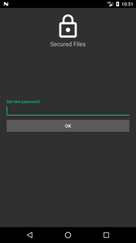
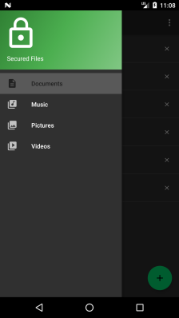
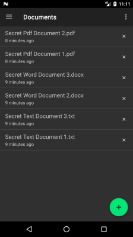

# Android-SecuredFiles

#### Android application allows to copy files from Downloads into internal app directory and protects access with password

 &nbsp;&nbsp;&nbsp;&nbsp;  &nbsp;&nbsp;&nbsp;&nbsp; 

#### How it works

1. Set password on first launch 
2. Click floating button `add`
3. Select files from Downloads dir and click `done`
4. Use Navigation Panel to filter files by types
5. Use Operation menu to change password

#### Security notes

1. Application encrypts only user password and does not encrypt file's content, so `root` user can access files
2. There is no way to restore password because application does not store plain password text

#### How to install

Please use [app/release/app-release.apk](./app/release/app-release.apk) file

#### Used language and libraries
 * [PBE](http://www.crypto-it.net/eng/theory/pbe.html) - password-based encryption
 * [Kotlin](https://kotlinlang.org/docs/tutorials/kotlin-android.html) - official Android language
 * [Android Architecture Components](https://developer.android.com/topic/libraries/architecture/index.html) - the core of [MVVM](https://en.wikipedia.org/wiki/Model%E2%80%93view%E2%80%93viewmodel) pattern 
 * [RxJava](https://github.com/ReactiveX/RxJava), [RxAndroid](https://github.com/ReactiveX/RxAndroid) - simple way to manage data chains
 * [Dagger](https://google.github.io/dagger/) - dependency injection framework
